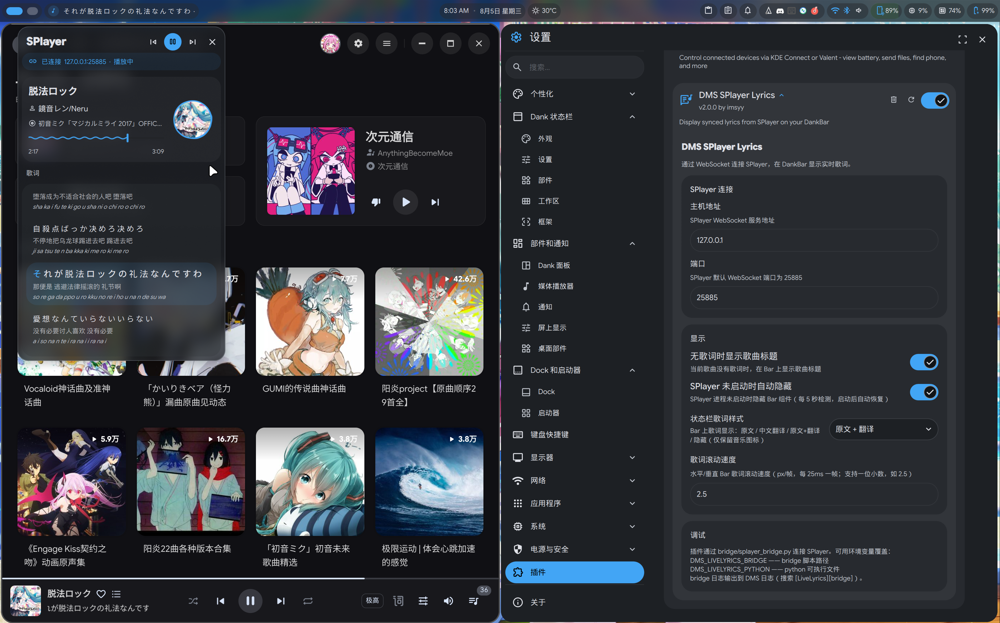
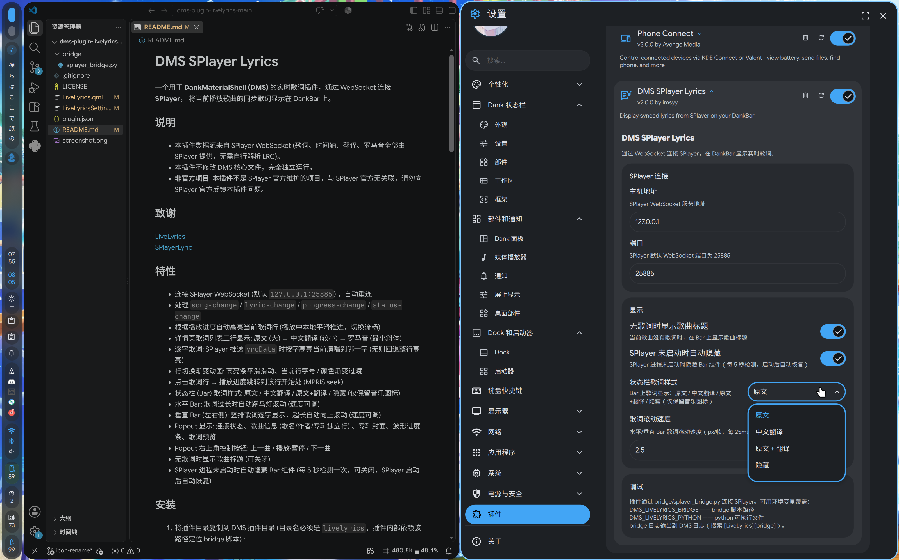

# DMS SPlayer Lyrics

一个用于 **DankMaterialShell (DMS)** 的实时歌词插件，通过 WebSocket 连接 **SPlayer**，
将当前播放歌曲的同步歌词显示在 DankBar 上。

## 说明

- 本插件数据源来自 SPlayer WebSocket (歌词、时间轴、翻译、罗马音全部由 SPlayer 提供，无需自行解析 LRC)。  
- 本插件不修改 DMS 核心文件，完全独立运行。
- **非官方项目**: 本插件不是 SPlayer 官方维护的项目，与 SPlayer 官方无关联，请勿向 SPlayer 官方反馈本插件问题。

## 致谢

[LiveLyrics](https://gitlab.com/noahpolimon/dms-plugin-livelyrics)  
[SPlayerLyric](https://github.com/iwvw/SPlayerLyric)  

## 预览

> 演示环境 Fedora 44 + Niri 26.04

 


## 特性

- 连接 SPlayer WebSocket (默认 `127.0.0.1:25885`) ，自动重连
- 处理 `song-change` / `lyric-change` / `progress-change` / `status-change`
- 根据播放进度自动高亮当前歌词行 (播放中本地平滑推进，切换流畅)  
- 详情页歌词列表三行显示: 原文 (大) → 中文翻译 (较小) → 罗马音 (最小斜体) 
- 逐字歌词: SPlayer 推送 `yrcData` 时按字高亮当前演唱到哪一字 (无则回退整行高亮) 
- 行切换渐变动画: 高亮条平滑滑动、当前行字号 / 颜色渐变过渡
- 点击歌词行 → 播放进度跳转到该行开始处 (MPRIS seek) 
- 状态栏 (Bar) 歌词样式: 原文 / 中文翻译 / 原文+翻译 / 隐藏 (仅保留音乐图标)
- 水平 Bar: 歌词过长时自动跑马灯滚动 (速度可调) 
- 垂直 Bar (左右侧): 竖排歌词逐字显示，超长自动向上滚动 (速度可调) 
- Popout 显示: 连接状态、歌曲信息 (歌名/作者/专辑独立行) 、专辑封面、波形进度条、歌词预览
- Popout 右上角控制按钮: 上一曲 / 播放·暂停 / 下一曲
- 无歌词时显示歌曲标题 (可关闭) 
- SPlayer 进程未启动时自动隐藏 Bar 组件 (每 5 秒检测一次，可关闭，SPlayer 启动后自动恢复) 

## 安装

1. 将插件目录复制到 DMS 插件目录 (目录名必须是 `livelyrics`，插件内部依赖该路径定位 bridge 脚本) : 

   ```bash
   git clone https://gitlab.com/noahpolimon/dms-plugin-livelyrics ~/.config/DankMaterialShell/plugins/livelyrics
   # 或手动复制: 
   # cp -r <本目录> ~/.config/DankMaterialShell/plugins/livelyrics
   ```

2. 安装 bridge 依赖 (Python 3 + websockets) : 

   ```bash
   pip install --user websockets
   # 或使用系统包管理器: sudo dnf install python3-websockets / sudo apt install python3-websockets
   ```

3. 打开 DMS 设置 → 插件，点击「扫描」，启用 **DMS SPlayer Lyrics**。

4. 将插件添加到 DankBar 组件列表 (设置 → 外观 → DankBar 布局)。

5. 重启 shell: 

   ```bash
   dms restart
   ```

6. 确认 SPlayer 已启动，且在 SPlayer 设置 → 网络与连接 中启用 WebSocket (WebSocket 服务默认监听 `127.0.0.1:25885`)。

## 配置

DMS 设置 → 插件 → DMS SPlayer Lyrics: 

| 设置项 | 说明 | 默认值 |
|--------|------|--------|
| 主机地址 | SPlayer WebSocket 地址 | `127.0.0.1` |
| 端口 | SPlayer WebSocket 端口 | `25885` |
| 状态栏歌词样式 | Bar 显示: 原文 / 中文翻译 / 原文+翻译 / 隐藏 (仅图标) | 原文 |
| 歌词滚动速度 | 水平/垂直 Bar 歌词滚动速度 (px/帧，每 25ms 一帧，支持一位小数) | 2.5 |
| 无歌词时显示歌曲标题 | 无歌词时 Bar 上显示歌曲名 | 开 |
| SPlayer 未启动时自动隐藏 | SPlayer 进程未启动时隐藏 Bar 组件 | 开 |

## 架构

```
SPlayer (ws://127.0.0.1:25885)
    │  WebSocket JSON events (song-change / lyric-change / progress-change / status-change) 
    ▼
bridge/splayer_bridge.py    —— Python 客户端: 自动重连 (指数退避) ，
    │                          stdout 每行输出一个 JSON
    ▼
Quickshell Process + SplitParser("\n")   —— 读取 bridge 输出
    ▼
LiveLyrics.qml              —— JSON 解析、事件分发、按 currentTime 查找当前歌词
    ▼
Bar Pill / Popout           —— 歌词显示 (三行歌词: 原文 / 翻译 / 罗马音、歌词预览) 
    ▼
MPRIS (可选)               —— 专辑封面、波形进度条、播放/暂停/上下曲控制、点击歌词 seek
```

## 调试

插件日志前缀 `[LiveLyrics]`，bridge 日志前缀 `[LiveLyrics][bridge]`。

```bash
# 查看 DMS 日志
journalctl --user -u dankmaterialshell -f | grep -i livelyrics

# 单独测试 bridge (不经过 DMS)  : 
python3 ~/.config/DankMaterialShell/plugins/livelyrics/bridge/splayer_bridge.py 127.0.0.1 25885
# 正常输出应为每行一个 JSON，例如: 
# {"type": "__status", "data": {"connected": true, ...}}
# {"type": "__event", "data": {"type": "song-change", ...}}

# 环境变量覆盖 (可选)  
DMS_LIVELYRICS_BRIDGE=/path/to/splayer_bridge.py   # 自定义 bridge 脚本路径
DMS_LIVELYRICS_PYTHON=/path/to/python              # 自定义 python (如 venv)  
```
SPlayer WebSocket 协议 (实测确认) : 

- 连接后 SPlayer 推送 `welcome` 事件。
- `progress-change` 约每 500ms 推送一次，含 `timestamp` 字段。
- `song-change` 的 `title` 为「歌名 - 歌手」组合格式，`name` 为纯歌名。
- `lyric-change` 的 `lrcData` 每项是一行: 
  - `words`: 逐字时间轴 (`startTime`/`endTime`/`word`，毫秒) 
  - `translatedLyric` / `romanLyric`: 翻译 / 罗马音 (字符串或数组) 
  - 行级 `startTime`/`endTime` 字段 (插件优先使用) 
  - 无歌词时 `lrcData` 为空数组
- 时间单位均为毫秒；SPlayer 不重放当前状态，仅推送新事件。
- **拖动进度条 / 单曲循环回退 / 暂停·恢复播放时，SPlayer 都会重推同一首歌的
  `song-change`，但不重推 `lyric-change`** (歌词数据仍有效，插件会识别同曲并保留歌词，仅刷新时长)。

## 常见问题

- **Bar 上的歌词组件完全消失 (不是显示「未连接」)**: 正常行为——插件每 5 秒检测一次 SPlayer 进程。
- **SPlayer 进程未启动时组件自动隐藏**。启动 SPlayer 后最多 5 秒内组件自动恢复。可在插件设置中关闭「SPlayer 未启动时自动隐藏」开关（DMS 设置 → 插件 → DMS SPlayer Lyrics）。
- **Bar 上显示「SPlayer 未连接」**: 说明 SPlayer 进程在运行但 WebSocket 尚未就绪 (或端口设置错误)。确认 SPlayer 设置 → 网络与连接 已启用 WebSocket (默认 `127.0.0.1:25885`)；bridge 会自动重连，无需重启 DMS。
- **歌词一直显示「等待歌词」**: SPlayer 只在换歌时推送 `lyric-change`，重连后需等下一首歌才会收到歌词 (正在播放的歌曲不会重放)。
- **点击歌词行不跳转**: 需要 MPRIS 支持 seek (绝大多数播放器支持)；不支持时日志会提示。
- **详情页无专辑封面/波形**: 插件从 MPRIS 获取封面与进度，确认 SPlayer 已通过 MPRIS 注册 (DMS 媒体控件能显示即可)。
- **建议设置 SPlayer 开机自启**: 防止可能的不必要空间占用与重连等待。

## 文件结构

```
plugins/livelyrics/
├── plugin.json               # 插件清单 (widget 类型) 
├── LiveLyrics.qml            # 主组件: bridge 生命周期、事件分发、歌词查找、UI
├── LiveLyricsSettings.qml    # 设置页
└── bridge/
    └── splayer_bridge.py     # Python WebSocket 客户端 → stdout JSON lines
```

## 许可协议

[MIT](LICENSE)
